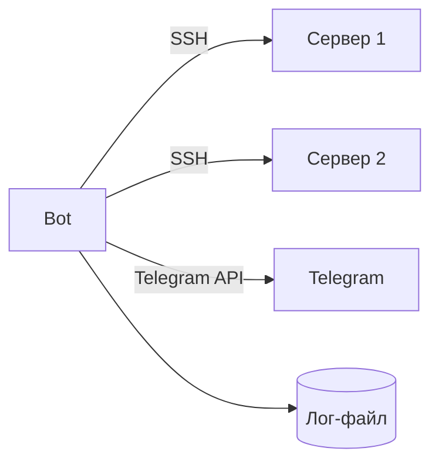

# 🤖 Telegram-бот для мониторинга серверов

## Краткое техническое руководство

---

## 1. Выбор темы и стека технологий

**Тема:** Telegram-бот для мониторинга серверов с автоуправлением службами

**Стек технологий:**
- Python 3.10+
- Paramiko (SSH)
- python-telegram-bot
- asyncio
- JSON (конфигурация и логи)

---

## 2. Архитектура проекта

**Диаграмма последовательности:**


---

## 3. Пошаговая инструкция

### Шаг 1: Установка

Скачивание Fin_Server.py из [репозитория](https://github.com/ZephyrFL/MosPolyPra/blob/main/src/Fin_Server.py) и установка библеотек.

`paramiko`, `python-telegram-bot`, `asyncio`, `json`

```bash
pip install paramiko python-telegram-bot 
```

### Шаг 2: Создание Telegram-бота

1. Найти [@BotFather](https://t.me/botfather) в Telegram
2. Отправить `/newbot`
3. Получить токен

### Шаг 3: Файл конфигурации `config.json`

```json
{
    "SERVERS": [
        {
            "hostname": "192.168.1.100",
            "username": "admin",
            "password": "pass",
            "critical_service": "nginx"
        }
    ],
    "CPU_THRESHOLD": 80,
    "MEMORY_THRESHOLD": 85,
    "TELEGRAM_TOKEN": "ваш_токен",
    "TELEGRAM_CHAT_ID": "id_чата",
    "LOG_FILE": "metrics.log"
}
```

### Шаг 4: Запуск

```bash
python3 Fin_Server.py
```

---

## 4. Участники проекта

| Участник | Вклад |
|----------|-------|
| Курылева Софья Алексеевна | Архитектура, Telegram-интеграция |
| Козенков Даниил Алексеевич | SSH-подключение, парсинг метрик |

---
